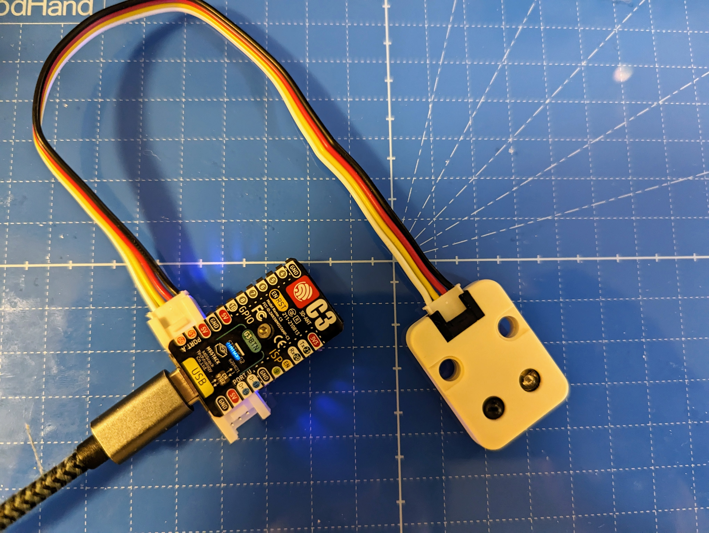

# IR Server M5StampC3



A WebServer running on M5StampC3 that sends infrared signals when POSTed in JSON format.

Implemented on CircuitPython.

M5StampC3 で WebServer を立てて、赤外線信号を JSON 形式で POST すると、送信してくれるやつ。

CircuitPyhon 上に実装。

```python
import requests

data = {
    "pulse": [ 2403, 642, 1170, 645, 588, 621, 1167, 648, 588,
        621, 1191, 624, 588, 621, 588, 621, 1167, 648, 588, 621, 588,
        624, 585, 624, 588,
    ]
}

url = f"http://192.168.1.193/api/ir"

res = requests.post(url, json.dumps(data))

print(f"status: {res.status_code}")
print("body:")
print(res.text)
```

## Requirements 必要なもの

- M5Stamp C3 Mate
  - official: https://shop.m5stack.com/products/m5stamp-c3-mate-with-pin-headers
  - Switch Science: https://www.switch-science.com/products/7474
- M5Stack IR Unit 用赤外線送受信ユニット
  - official: https://docs.m5stack.com/en/unit/ir
  - Switch Science: https://www.switch-science.com/products/5699

## install

CIRCUIT PYTHON: https://circuitpython.org/board/m5stack_stamp_c3/

How to upload firmware and code, etc.
ファームウェアやコードのアップロードの方法など
https://learn.adafruit.com/circuitpython-with-esp32-quick-start

Since the ESP32-C3 does not have USB device capability, after burning the CIRCUIT PYTHON firmware, the code is uploaded via HTTP.
ESP32-C3 は USB デバイス機能はないため、CIRCUIT PYTHON のファームウェアを焼いた後は、HTTP 経由でコードをアップロードする。

https://learn.adafruit.com/circuitpython-with-esp32-quick-start/setting-up-web-workflow

Upload main.py as code.py.
main.py を code.py としてアップロードする。

## LICENSE

MIT

### imported

- adafruit_httpserver (MIT): https://github.com/adafruit/Adafruit_CircuitPython_HTTPServer
